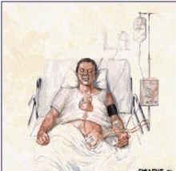

# 呼吸困难
## 发生机制及临床表现
根据发生机制及临床表现特点，将呼吸困难归纳分为以下五种类型。

1.肺源性呼吸困难肺源性呼吸困难主要是呼吸系统疾病引起的通气、换气功能障碍导致缺氧和(或)二氧化碳潴留引起。临床上常 分为三种类型:

(1)吸气性呼吸困难:主要特点表现为吸气显著费力，严重者吸气时可见“三凹征”(three depression sign)，表现为胸骨上窝、 锁骨上窝和肋间隙明显凹陷，此时亦可伴有干咳及高调吸气性喉鸣。三凹征的出现主要是由于呼吸肌极度用力，胸腔负压增加所 致。常见于喉部、气管、大支气管的狭窄与阻塞。

(2)呼气性呼吸困难:主要特点表现为呼气费力、呼气缓慢、呼吸时间明显延长，常伴有呼气期哮鸣音。主要是由于肺泡弹性减弱 和(或)小支气管的痉挛或炎症所致。常见于慢性支气管炎(喘息型)、慢性阻塞性肺气肿、支气管哮喘、弥漫性泛细支气管炎等。

(3)混合性呼吸困难:主要特点表现为吸气期及呼气期均感呼吸费力、，呼吸频率增快、深度变浅，可伴有呼吸音异常或病理性呼 吸音。主要是由于肺或胸膜腔病变使肺呼吸面积减少导致换气功能障碍所致。常见于重症肺炎、重症肺结核、大面积肺栓塞(梗 死)、弥漫性肺间质疾病、大量胸腔积液、气胸、广泛性胸膜增厚等。

2.心源性呼吸困难 主要是由于左心和(或)右心衰竭引起，尤其是左心衰竭时呼吸困难更为严重。
左心衰竭发生的主要原因是肺淤血和肺泡弹性降低。其机制为:1肺淤血，使气体弥散功能降低;2肺泡张力增高，刺激牵张感受 器，通过迷走神经反射兴奋呼吸中枢;3肺泡弹性减退，使肺活量减少;4肺循环压力升高对呼吸中枢的反射性刺激。

左心衰竭引起的呼吸困难特点为:1有引起左心衰竭的基础病因，如风湿性心脏病、高血压心脏病、冠状动脉硬化性心脏病等;2 呈混合性呼吸困难，活动时呼吸困难出现或加重，休息时减轻或消失，卧位明显，坐位或立位时减轻，故而当病人病情较重时，往 往被迫采取半坐位或端坐体位呼吸(orthopnea);3两肺底部或全肺出现湿啰音;4应用强心剂、利尿剂和血管扩张剂改善左心功 能后呼吸困难症状随之好转。

急性左心衰竭时，常可出现夜间阵发性呼吸困难，表现为夜间睡眠中突感胸闷气急，被迫坐起，惊恐不安。轻者数分钟至数十分钟 后症状逐渐减轻、消失;重者可见端坐呼吸、面色发绀、大汗、有哮鸣音，咳浆液性粉红色泡沫痰，两肺底有较多湿性啰音，心率 加快，可有奔马律。此种呼吸困难称“心源性哮喘”(cardiac asthma)。左心衰竭发生机制为:1睡眠时迷走神经兴奋性增高，冠 状动脉收缩、心肌供血减少，心功能降低;2小支气管收缩，肺泡通气量减少;3仰卧位时肺活量减少，下半身静脉回心血量增 多，致肺淤血加重;4呼吸中枢敏感性降低，对肺淤血引起的轻度缺氧反应迟钝，当淤血加重，缺氧明显时，才刺激呼吸中枢作出 应答反应。

右心衰竭严重时也可引起呼吸困难，但程度较左心衰竭轻，其主要原因为体循环淤血所致。其发生机制为:1右心房和上腔静脉压 升高，刺激压力感受器反射性地兴奋呼吸中枢;2血氧含量减少，乳酸、丙酮酸等代谢产物增加，刺激呼吸中枢;3淤血性肝大、 腹腔积液和胸腔积液，使呼吸运动受限，肺交换面积减少。临床上主要见于慢性肺源性心脏病、某些先天性心脏病或由左心衰竭发 展而来。另外，也可见于各种原因所致的急性或慢性心包积液。其发生呼吸困难的主要机制是大量心包渗液致心包压塞或心包纤维 性增厚、钙化、缩窄，使心脏舒张受限，引起体循环静脉淤血所致。

3.中毒性呼吸困难 代谢性酸中毒可导致血中代谢产物增多，刺激颈动脉窦、主动脉体化学受体或直接兴奋刺激呼吸中枢引起呼吸 困难。其主要表现为:1有引起代谢性酸中毒的基础病因，如尿毒症、糖尿病酮症等;2出现深长而规则的呼吸，可伴有鼾音，称 为酸中毒大呼吸(Kussmaul呼吸)。

某些药物如吗啡类、巴比妥类等中枢抑制药物和有机磷杀虫药中毒时，可抑制呼吸中枢引起呼吸困难。其主要特点为:1有药物或 化学物质中毒史;2呼吸缓慢、变浅伴有呼吸节律异常的改变如cheyne-Stokes呼吸(潮式呼吸)或Biots呼吸(间停呼吸)。

化学毒物中毒可导致机体缺氧引起呼吸困难，常见于一氧化碳中毒、亚硝酸盐和苯胺类中毒、氢化物中毒。其发生机制分别为:一 氧化碳中毒时，吸入的CO与血红蛋白结合形成碳氧血红蛋白，失去携带氧的能力导致缺氧而产生呼吸困难;亚硝酸盐和苯胺类中毒 时，使血红蛋白变为高铁血红蛋白失去携带氧的能力导致缺氧;氢化物中毒时，氢离子抑制细胞色素氧化酶的活性，影响细胞呼吸 作用，导致组织缺氧引起呼吸困难，严重时引起脑水肿抑制呼吸中枢。

4.神经精神性呼吸困难 神经性呼吸困难主要是由于呼吸中枢受增高的颅内压和供血减少的刺激，使呼吸变为慢而深，并常伴有呼 吸节律的改变，如双吸气(抽泣样呼吸)、呼吸遏制(吸气突然停止)等。临床上常见于重症颅脑疾患，如脑出血、脑炎、脑膜炎、脑 脓肿、脑外伤及脑肿瘤等。

精神性呼吸困难主要表现为呼吸频率快而浅，伴有叹息样呼吸或出现手足搐搦。临床上常见于癔症患者，病人可突然发生呼吸困 难。其发生机制多为过度通气而发生呼吸性碱中毒所致，严重时也可出现意识障碍。

5.血源性呼吸困难 多由红细胞携氧量减少，血氧含量降低所致。表现为呼吸浅，心率快。临床常见于重度贫血、高铁血红蛋白血 症、硫化血红蛋白血症。除此以外，大出血或休克时，因缺氧和血压下降，刺激呼吸中枢，也可使呼吸加快。

## 伴随症状
1.发作性呼吸困难伴哮鸣音 多见于支气管哮喘、心源性哮喘;突发性重度呼吸困难见于急性喉水肿、气管异物、大面积肺栓塞、 自发性气胸等。

2.呼吸困难伴发热 多见于肺炎、肺脓肿、肺结核、胸膜炎、急性心包炎等。

3.呼吸困难伴一侧胸痛 见于大叶性肺炎、急性渗出性胸膜炎、肺栓塞、自发性气胸、急性心肌梗死、支气管肺癌等。

4.呼吸困难伴咳嗽、咳痰 见于慢性支气管炎、阻塞性肺气肿继发肺部感染、支气管扩张、肺脓肿等;伴大量泡沫痰可见于有机磷 中毒;伴粉红色泡沫痰见于急性左心衰竭。

5.呼吸困难伴意识障碍 见于脑出血、脑膜炎、糖尿病酮症酸中毒、尿毒症、肺性脑病、急性中毒、休克型肺炎等。 

## 问诊要点
1.呼吸困难发生的诱因 包括有无引起呼吸困难的基础病因和直接诱因，如心、肺疾病、肾病、代谢性疾病病史和有无药物、毒物 摄入史及头痛、意识障碍、颅脑外伤史。

2.呼吸困难发生的快与慢 询问起病是突然发生、缓慢发生、还是渐进发生或者有明显的时间性。 

3.呼吸困难与活动、体位的关系 如左心衰竭引起的呼吸困难。 

4.伴随症状如发热、咳嗽、咳痰、咯血、胸痛等。1

